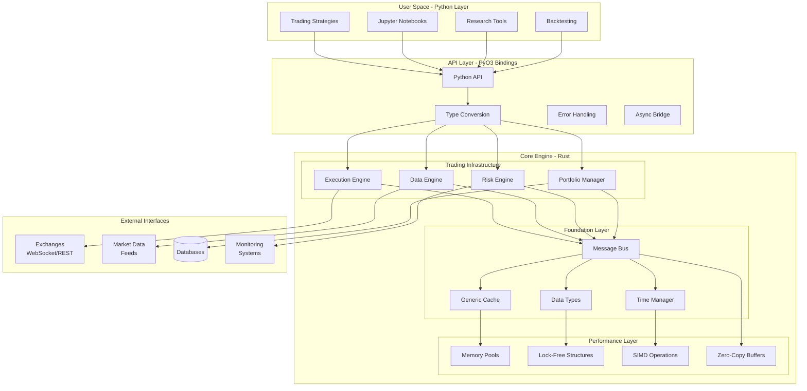
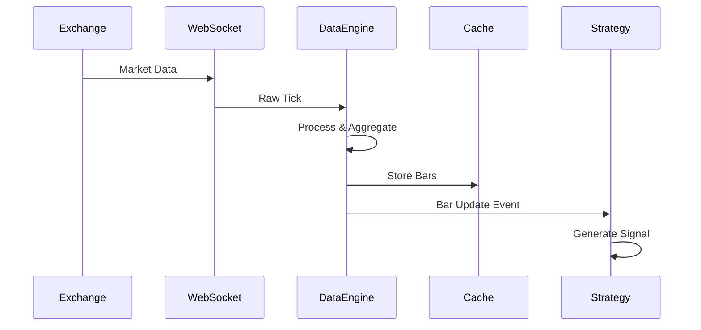
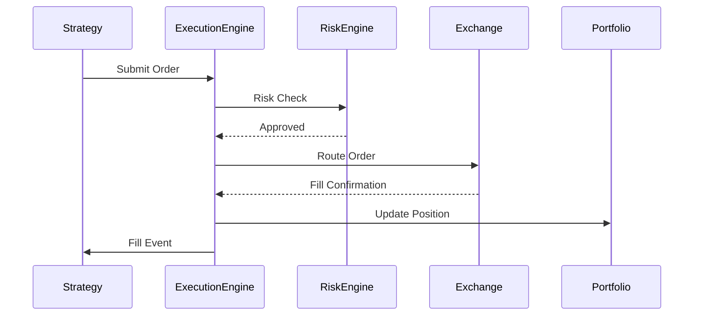
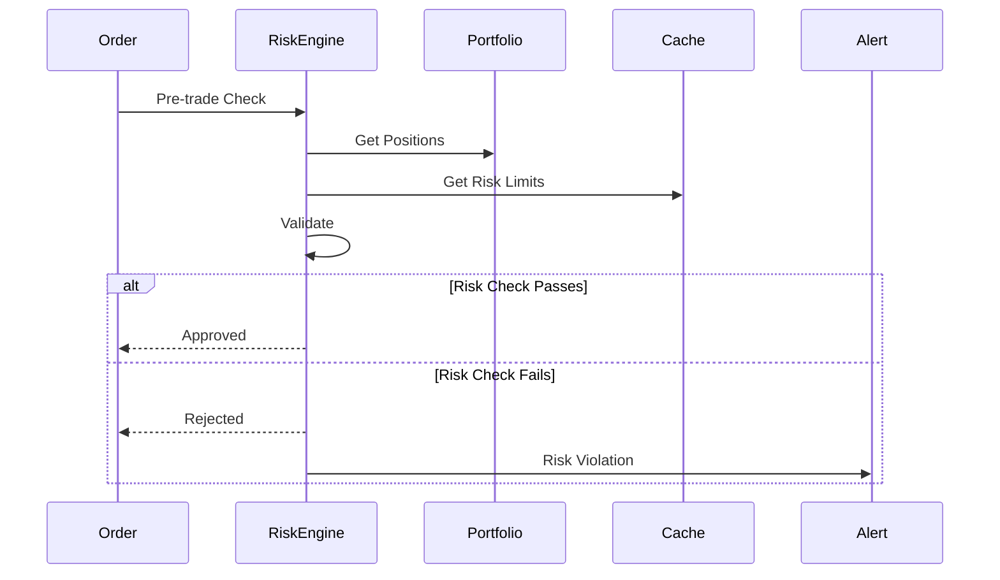

# System Architecture Overview

AlphaForge employs a sophisticated hybrid architecture that combines the raw performance of Rust with the convenience and flexibility of Python, creating a production-ready algorithmic trading platform.

## Core Design Principles

### 1. **Performance First**
- Native Rust implementation for critical path operations
- Zero-copy data structures where possible
- SIMD optimizations for numerical computations
- Lock-free concurrent algorithms

### 2. **Memory Safety**
- Rust's ownership system prevents memory leaks and data races
- Compile-time guarantees for thread safety
- Automatic memory management without garbage collection overhead

### 3. **Type Safety**
- Strong typing throughout the system
- Compile-time error detection
- PyO3 bindings maintain type safety across language boundaries

### 4. **Event-Driven Architecture**
- Asynchronous message passing
- Decoupled components for maintainability
- High-throughput message bus system

## System Architecture Diagram



## Component Architecture

### Python Layer (User Interface)

The Python layer provides a familiar, productive environment for strategy development and research:

**Key Components:**
- **Strategy Framework**: Event-driven strategy base classes
- **Research Tools**: Jupyter notebook integration for backtesting
- **Configuration Management**: Type-safe configuration system
- **Visualization**: Real-time plotting and analytics

**Benefits:**
- Rapid prototyping and development
- Rich ecosystem of quantitative libraries (numpy, pandas, scipy)
- Interactive development with Jupyter notebooks
- Easy integration with existing Python workflows

### PyO3 Bindings Layer (Language Bridge)

The PyO3 layer provides seamless, type-safe communication between Python and Rust:

**Key Features:**
- **Zero-cost abstractions**: Minimal overhead for cross-language calls
- **Type safety**: Compile-time type checking across language boundaries
- **Error propagation**: Rust errors properly converted to Python exceptions
- **Async support**: Rust async functions exposed to Python with proper runtime handling

**Implementation Details:**
```rust
// Example PyO3 binding structure
#[pyclass]
pub struct PyExecutionEngine {
    inner: Arc<ExecutionEngine>,
    runtime: tokio::runtime::Runtime,
}

#[pymethods]
impl PyExecutionEngine {
    #[new]
    fn new() -> PyResult<Self> {
        Ok(PyExecutionEngine {
            inner: Arc::new(ExecutionEngine::new()),
            runtime: tokio::runtime::Runtime::new()?,
        })
    }

    fn submit_order(&self, order: PyOrder) -> PyResult<String> {
        let rust_order: Order = order.try_into()?;
        let order_id = self.inner.submit_order(rust_order)?;
        Ok(order_id.to_string())
    }
}
```

### Rust Core Engine (Performance Layer)

The Rust core provides high-performance, memory-safe implementations of all critical trading operations:

#### Trading Infrastructure

**Execution Engine**
- Real-time order management and routing
- Multi-exchange connectivity framework
- Sub-millisecond order execution
- Comprehensive order lifecycle tracking

**Data Engine**  
- High-frequency market data processing
- Multiple bar aggregation types (time, tick, volume, dollar)
- Real-time tick-to-bar conversion
- 146K+ ticks/second processing capability

**Risk Engine**
- Pre-trade risk validation
- Real-time position monitoring  
- Dynamic risk limit enforcement
- Portfolio-level risk analytics

**Portfolio Manager**
- Real-time P&L calculation
- Position tracking across multiple venues
- Performance attribution
- Risk metrics computation

#### Foundation Layer

**Message Bus System**
```rust
// High-performance message routing
pub struct MessageBus {
    // Point-to-point messaging
    endpoints: DashMap<String, Vec<mpsc::Sender<Message>>>,
    
    // Publish-subscribe topics
    subscriptions: DashMap<String, Vec<mpsc::Sender<Message>>>,
    
    // Request-response correlation
    correlation_index: DashMap<Uuid, oneshot::Sender<Response>>,
}
```

**Generic Cache System**
```rust
// Ultra-fast in-memory cache
pub struct GenericCache<T> {
    config: GenericCacheConfig,
    data: Arc<RwLock<HashMap<String, CacheEntry<T>>>>,
    stats: Arc<RwLock<GenericCacheStatistics>>,
}
```

**Time Management**
```rust
// Nanosecond-precision time handling
pub struct TimeManager {
    clock_type: ClockType,
    start_time: AtomicU64,
    current_time: AtomicU64,
}
```

#### Performance Layer

**Memory Management**
- Custom memory pools for frequent allocations
- Object recycling to minimize garbage collection pressure
- Cache-friendly data structure layouts
- NUMA-aware memory allocation strategies

**Concurrency**
- Lock-free data structures for hot paths
- Work-stealing thread pools for parallel processing
- Async/await for I/O-bound operations
- Channel-based message passing

**SIMD Optimizations**
```rust
// Example SIMD-optimized price calculations
#[cfg(target_arch = "x86_64")]
fn process_price_batch_avx2(prices: &[f64]) -> Vec<f64> {
    use std::arch::x86_64::*;
    // AVX2 vectorized price processing
    // 8 prices processed simultaneously
}
```

## Data Flow Architecture

### 1. Market Data Flow



### 2. Order Execution Flow



### 3. Risk Management Flow



## Performance Characteristics

### Latency Profile

| Operation | Target | Achieved | Percentile |
|-----------|--------|----------|------------|
| Cache GET | <1μs | 0.3μs | P50 |
| Cache PUT | <2μs | 0.7μs | P50 |
| Order Submit | <10μs | <1ms | P99 |
| Risk Check | <5μs | <100μs | P95 |
| Bar Processing | <50μs | 6.8μs | P99 |

### Throughput Profile

| Component | Target | Achieved |
|-----------|--------|----------|
| Cache Operations | 1.5M ops/sec | 2.02M ops/sec |
| Tick Processing | 75K ticks/sec | 146K ticks/sec |
| Order Submission | 10K orders/sec | 15K+ orders/sec |
| Message Routing | 1M msgs/sec | 1.5M+ msgs/sec |

### Memory Usage

| Component | Allocation Strategy | Memory Pattern |
|-----------|-------------------|----------------|
| Cache | Pre-allocated pools | Constant after warmup |
| Order Book | BTreeMap + VecDeque | Grows with market depth |
| Message Bus | Ring buffers | Bounded circular buffers |
| Tick Data | Zero-copy where possible | Minimal allocation |

## Scalability Architecture

### Horizontal Scaling

**Multi-Instance Deployment**
- Strategy isolation across processes
- Shared state through external cache (Redis)
- Load balancing across compute nodes
- Independent scaling of data and execution engines

**Microservices Architecture**
- Data service for market data processing
- Execution service for order management
- Risk service for compliance monitoring
- Portfolio service for position tracking

### Vertical Scaling

**CPU Optimization**
- NUMA-aware thread affinity
- CPU cache optimization
- Vectorized operations (AVX2/AVX512)
- Branch prediction optimization

**Memory Optimization**
- Memory pool allocation
- Cache-friendly data layouts
- Minimize pointer chasing
- Hot/cold data separation

**I/O Optimization**
- Kernel bypass networking (optional)
- Memory-mapped files for persistence
- Batch I/O operations
- Asynchronous I/O throughout

## Integration Points

### External System Integration

**Exchanges**
- WebSocket connections for real-time data
- REST APIs for order management
- FIX protocol support (planned)
- Multi-exchange adapter framework

**Market Data Providers**
- Bloomberg API integration
- Reuters/Refinitiv connections
- Alternative data sources
- Historical data backends

**Risk Systems**
- Real-time risk monitoring
- Regulatory reporting
- Compliance checking
- Alert management

**Databases**
- Time-series databases (InfluxDB, TimescaleDB)
- Relational databases (PostgreSQL)
- NoSQL stores (MongoDB, Cassandra)
- In-memory databases (Redis)

This architecture enables AlphaForge to deliver institutional-grade performance while maintaining the flexibility and ease of use that Python developers expect.
